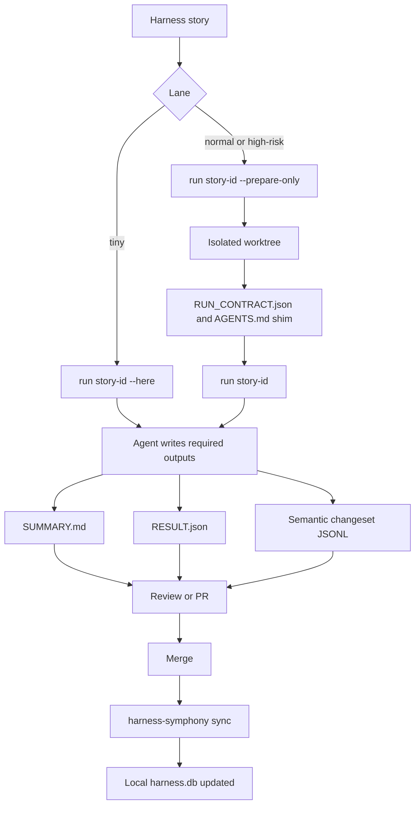
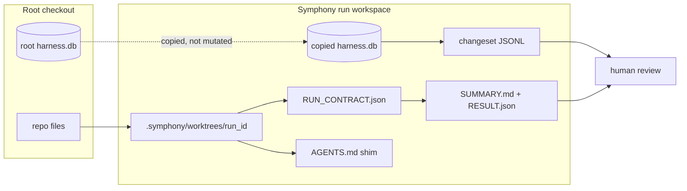

# Harness Symphony Quick Start

Harness Symphony is the local runner for Harness stories. It prepares a safe
workspace, gives the agent an explicit contract, collects the result, and keeps
durable Harness state reviewable through committed changesets.

Use this guide when you want to run a story, not when you want to understand the
full design. The full design lives in `docs/SYMPHONY_SCOPE.md`.

## What Symphony Does

Symphony turns this:

```text
Harness story
```

into this:

```text
isolated run workspace
  + copied harness.db
  + RUN_CONTRACT.json
  + agent execution
  + SUMMARY.md
  + RESULT.json
  + .harness/changesets/<run_id>.changeset.jsonl
```

The important rule: the root `harness.db` is not the source of truth for a run.
The run writes to a copied database, and durable Harness changes are preserved
as semantic changesets.

## Visual Map

Use this as the quick mental picture:

```text
+---------------+
| Harness story |
+-------+-------+
        | work list chooses a runnable story
        v
+-------------------------------------------------------------+
| Normal / high-risk run                                      |
|                                                             |
|  .symphony/worktrees/<run_id>/                              |
|    +- harness.db                copied DB for this run       |
|    +- AGENTS.md                 Symphony shim for the agent  |
|    +- .harness/runs/<run_id>/RUN_CONTRACT.json              |
+-------+-----------------------------------------------------+
        | agent works only inside the assigned run contract
        v
+-------------------------------------------------------------+
| Required outputs                                            |
|                                                             |
|  .harness/runs/<run_id>/SUMMARY.md                          |
|  .harness/runs/<run_id>/RESULT.json                         |
|  .harness/changesets/<run_id>.changeset.jsonl               |
+-------+-----------------------------------------------------+
        | review, merge, then replay committed changesets
        v
+-----------------------+
| harness-symphony sync |
+-----------------------+
```

Tiny stories take a shorter path:

```text
+------------+
| tiny story |
+-----+------+
        | harness-symphony run <story-id> --here
        v
+-------------------------------------------------------------+
| current checkout                                            |
|   + copied DB under .symphony/runs/                         |
|   + SUMMARY.md, RESULT.json, and changeset still required   |
+-------------------------------------------------------------+
```

## Mermaid Flow





## First Run Checklist

Run these from the repository root.

### 1. Check The Installed CLI

```bash
command -v harness-symphony
```

The Harness installer must provision `harness-symphony` on `PATH`. If this
check fails, install or upgrade the Harness package before continuing. Source
repository contributors may build the crate locally, but fresh installs do not
contain the Cargo workspace and must not rely on `target/debug` paths.

Check the available commands:

```bash
harness-symphony --help
```

### 2. Check Readiness

```bash
harness-symphony doctor
```

Fix any `fail` rows before running a normal story. Warnings are usually
actionable configuration gaps; read the message before deciding to continue.

### 3. Open The Local Controller

Start the Web UI from the repository root:

```bash
harness-symphony web
```

After the server binds, Symphony opens the controller in the system default
browser. For CI, SSH, Electron, or other headless use, keep the server running
without opening a browser:

```bash
harness-symphony web --no-open
```

If the browser cannot be opened, Symphony prints the controller URL and keeps
the server available for manual opening.

Manual start is optional for execution: `harness-symphony run` and
`harness-symphony auto` automatically spawn this server on `127.0.0.1:4317`
when the health endpoint identifies the same Symphony version and repository.
The identity probe uses bounded 300 ms connect, read, and write timeouts. A
foreign listener or a Symphony process for another checkout is not reused; stop
the process occupying the port or choose another port, then retry. Pass
`--no-web` to either command to skip controller startup.

If you installed Harness with Homebrew, the same commands are available without
the `target/debug/` prefix:

```bash
brew install winterzxzz/tap/harness
harness-symphony doctor
harness-symphony web
```

### 4. See Runnable Work

```bash
harness-symphony work list
```

Look for a story with `Runnable` set to `yes` or `warn`.

- `yes`: ready to run.
- `warn`: runnable, but something important is missing, often a verification
  command.
- `no`: do not run it through Symphony yet.

### 5. Prepare A Normal Or High-Risk Story

Use `--prepare-only` when you want to inspect what Symphony will give the agent
before actually launching one:

```bash
harness-symphony run <story-id> --prepare-only
```

Prepare does not pull from upstream: the run branches from your current HEAD.
Pull first if the run should start from the latest merged state.

This creates an isolated worktree under:

```text
.symphony/worktrees/<run_id>/
```

It also creates a run contract at:

```text
.harness/runs/<run_id>/RUN_CONTRACT.json
```

The worktree `AGENTS.md` contains a Symphony block that points the agent to the
contract and repeats the assigned story, copied database path, required outputs,
and forbidden paths.

### 6. Execute A Normal Or High-Risk Story

When the repo is configured with an agent adapter, run:

```bash
harness-symphony run <story-id>
```

The agent must produce:

```text
.harness/runs/<run_id>/SUMMARY.md
.harness/runs/<run_id>/RESULT.json
```

If the run writes durable Harness records, it must also produce:

```text
.harness/changesets/<run_id>.changeset.jsonl
```

Symphony validates the result before accepting the run.

## Tiny Story Shortcut

Tiny-lane stories can use a lighter path:

```bash
harness-symphony run <story-id> --here
```

Use `--here` only for tiny stories. It skips the separate worktree, but it still
uses a copied database and still requires the same run artifacts.

Do not use `--here` for normal or high-risk work. Symphony refuses those lanes
because they need the full isolation loop.

## After A Run

Check status:

```bash
harness-symphony status
```

List runs:

```bash
harness-symphony runs list
```

Inspect one run:

```bash
harness-symphony runs show <run_id>
```

Review these local files before opening a PR:

```text
.harness/runs/<run_id>/SUMMARY.md
.harness/runs/<run_id>/RESULT.json
.harness/changesets/<run_id>.changeset.jsonl
```

`SUMMARY.md` is the human review surface. It should include a readable Harness
changes table so reviewers do not have to inspect raw JSONL first. PR creation
uses the summary as the PR body and commits only the durable changeset artifact.
If PR creation is disabled, review these artifacts locally before syncing.

## Optional PR Flow

If PR creation is configured, create a PR for a finished run:

```bash
harness-symphony pr create <run_id>
```

Retry PR creation after fixing configuration or provider issues:

```bash
harness-symphony pr retry <run_id>
```

PRs should include the run summary, result file, changeset, and any product or
docs changes made by the agent.

When `pull_request.create` is `disabled`, completed runs stay in Review as a
local artifact-review step instead of becoming Needs Attention for missing PR
creation.

## After Merge

After pulling merged changes, apply committed changesets to your local
`harness.db`:

```bash
harness-symphony sync
```

`sync` is idempotent. Running it twice is safe; already applied changesets are
skipped.

On a fresh clone, rebuild the local Harness database from committed changesets:

```bash
scripts/bin/harness-cli db rebuild --from .harness/changesets
```

## Minimal Configuration

Symphony reads optional configuration from:

```text
.harness/symphony.yml
```

Defaults are usable for local development. To use the first-class Codex adapter:

```yaml
version: 1
agent:
  adapter: codex
```

For the first-class OpenCode adapter (headless `opencode run --auto`):

```yaml
version: 1
agent:
  adapter: opencode
```

The web UI can also pick the agent per run: the board Run button is a split
button (Codex/OpenCode), the chosen agent is remembered as the default in the
Symphony state DB, and the Settings tab manages the same default via
`GET/PUT /api/settings`.

For a custom one-shot command adapter:

```yaml
version: 1
agent:
  adapter: custom
  command:
    - ./scripts/run-agent.sh
```

Agent execution defaults to a 10-minute timeout. Automatic runs also fail
closed when the upstream base cannot be refreshed: `auto.allow_stale_base`
defaults to `false`. Opt in only when running from the current, recorded base is
an acceptable recovery tradeoff:

```yaml
version: 1
agent:
  timeout_minutes: 10
auto:
  allow_stale_base: true
```

After a timeout or preparation/execution failure, inspect `runs show <run_id>`
and its recovery action. Fix the reported cause, then use the offered retry,
replacement-run, or PR retry path; Symphony keeps the failed run as evidence
instead of silently resuming it.

Inspect the resolved configuration:

```bash
harness-symphony config show
```

## External Executor Lifecycle

Use the external lifecycle when a main agent must own orchestration while a
subagent implements inside Symphony's prepared worktree. Run the lifecycle
commands from the source repository, or pass `--repo-root <source-repo>`.

```bash
harness-symphony run <story-id> --prepare-only
harness-symphony runs start <run_id> --executor claude-subagent
harness-symphony runs heartbeat <run_id> --step "implementation started"
harness-symphony runs heartbeat <run_id>
harness-symphony runs complete <run_id>
```

The main agent owns every command above. The subagent edits only in the printed
worktree, writes `SUMMARY.md` and `RESULT.json`, and uses the run environment
for Harness CLI writes so semantic changes produce the matching changeset. It
must not invoke lifecycle commands or access the source repository's Symphony
state.

Send a heartbeat at least every 30 seconds. The default lease TTL is 120
seconds and `runs.external_heartbeat_ttl_seconds` can set another positive
value; keep the heartbeat interval at or below one quarter of that TTL.
Heartbeat without `--step` refreshes the lease without adding a duplicate
progress event. Use `--step` only for a changed, bounded milestone.

When the lease expires, Symphony marks the run `stale`, releases the active
lock, and keeps its worktree as evidence. A later `runs complete <run_id>` may
still validate late artifacts, even after a newer run becomes active; it does
not disturb that newer lock. Missing or invalid artifacts, or a changed copied
database without a valid matching changeset, complete as a validation failure.

The Web UI displays the existing agent name as the executor, shows normalized
milestones, and treats stale runs as Needs Attention.

## The Mental Model

This implementation is the Harness-local Symphony profile. It borrows the
Symphony operating model but is not an OpenAI-core-conformant runtime or a
drop-in implementation of OpenAI Symphony.

| If you want to... | Run... |
| --- | --- |
| Check whether Symphony can run here | `harness-symphony doctor` |
| Find runnable stories | `harness-symphony work list` |
| Create an isolated workspace only | `harness-symphony run <story-id> --prepare-only` |
| Run a normal or high-risk story | `harness-symphony run <story-id>` |
| Run a tiny story in the current checkout | `harness-symphony run <story-id> --here` |
| See what happened locally | `harness-symphony status` |
| Inspect a run | `harness-symphony runs show <run_id>` |
| Start a prepared external run | `harness-symphony runs start <run_id> --executor <name>` |
| Refresh an external lease | `harness-symphony runs heartbeat <run_id> [--step <text>]` |
| Complete an external run | `harness-symphony runs complete <run_id>` |
| Create a PR for a finished run | `harness-symphony pr create <run_id>` |
| Apply merged changesets | `harness-symphony sync` |

## Common Mistakes

- Do not send normal or high-risk stories through `--here`.
- Do not edit root `harness.db` to represent run results.
- Do not commit `.symphony/`; it is local runtime state.
- Do not review only raw changeset JSONL; read `SUMMARY.md` first.
- Do not forget `sync` after merging a Symphony PR.
- Do not treat Symphony as a second intake system. Harness chooses story scope
  and lane; Symphony runs the selected story safely.
